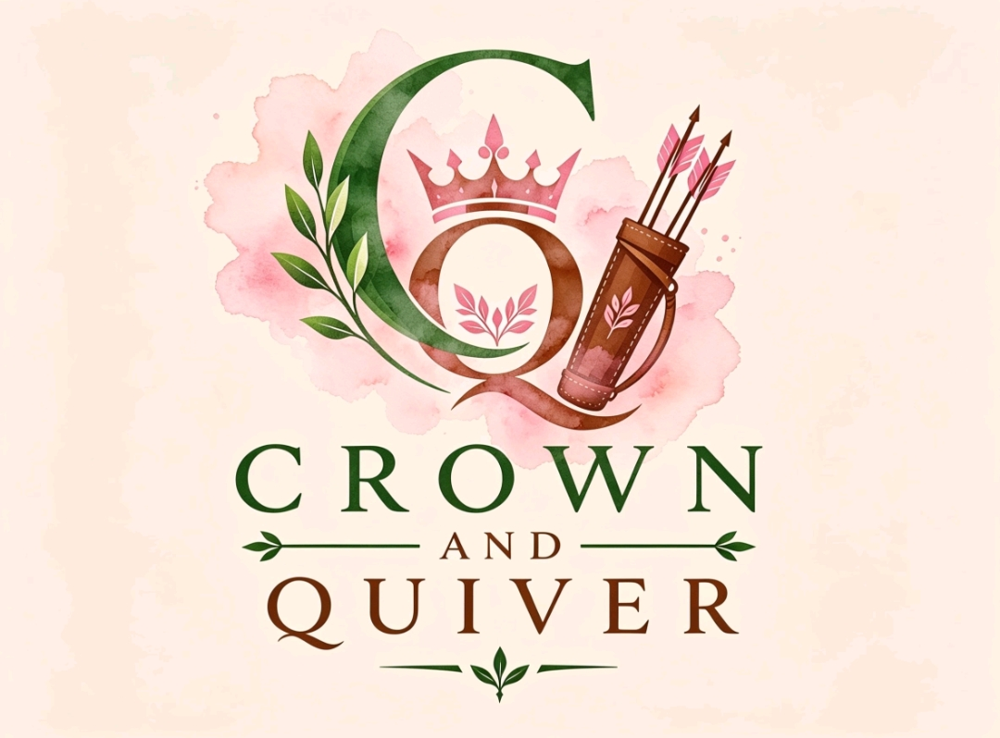

# 🏹👑 Crown & Quiver — APU Archery Club



Crown & Quiver is the official website for the APU Archery Club — a community of young women at Asia Pacific University who are passionate about archery, personal growth, and teamwork. The site introduces the club to prospective members, explains its mission, vision, and rules, and gives students an easy way to sign up.

🔗 The live link can be found here - https://crown-quiver.vercel.app/


---

## 📋 Table of Contents

- [🏹👑 Crown \& Quiver — APU Archery Club](#-crown--quiver--apu-archery-club)
  - [📋 Table of Contents](#-table-of-contents)
  - [🎨 UX](#-ux)
    - [👥 User Stories](#-user-stories)
    - [✏️ Wireframes](#️-wireframes)
    - [🌸 Colour Scheme](#-colour-scheme)
    - [🔤 Typography](#-typography)
  - [✨ Features](#-features)
    - [✅ Existing Features](#-existing-features)
    - [🚧 Features Left to Implement](#-features-left-to-implement)
  - [🛠️ Technologies Used](#️-technologies-used)
  - [🧪 Testing](#-testing)
  - [🚀 Deployment](#-deployment)
    - [💻 How to Run Locally](#-how-to-run-locally)
  - [🙏 Credits](#-credits)
    - [📝 Content](#-content)
    - [🖼️ Media](#️-media)
    - [💛 Acknowledgements](#-acknowledgements)

---

## 🎨 UX

### 👥 User Stories

- 🙋‍♀️ As a **prospective member** (APU female student), I want to quickly understand what the club is about, so that I can decide if I want to join.
- 📅 As a **prospective member**, I want to see the club's training schedule and activities, so that I know what to expect before signing up.
- ✍️ As a **prospective member**, I want an easy way to register my interest, so that I can become a member without hassle.
- 🦺 As a **new or beginner archer**, I want to read the club's rules and required attire/equipment, so that I arrive prepared and safe.
- 🏫 As a **university staff member**, I want to find contact information and understand the club's mission, so that I can support or approve club activities.
- 💰 As a **potential sponsor**, I want to see the club's credibility (mission, vision, achievements), so that I can decide whether to provide support.
- 🔁 As a **returning visitor / existing member**, I want to check upcoming events and the lesson timetable, so that I stay up to date with club activities.
- 📱 As **any visitor**, I want the site to be easy to navigate on both desktop and mobile, so that I can find information regardless of device.

### ✏️ Wireframes

Wireframes for desktop and mobile layouts were sketched out before development to plan section order and content hierarchy (Home → About → Mission/Vision → Objectives → Activities → Rules & Safety → Gallery → Join → Contact).

*(Add your wireframe images/screenshots here, e.g. from Balsamiq or Figma, once available.)*

### 🌸 Colour Scheme

The site uses a palette inspired by Princess Merida's natural, Scottish-highland aesthetic, softened with a feminine touch to suit the club's identity and target audience of young women:

| Colour | Hex | Usage |
|---|---|---|
| 🌲 Forest Green | `#2D4A3E` | Primary brand colour — navigation, headings, mission/vision banner |
| 🌑 Forest Green (dark) | `#1E332A` | Footer, gradient depth in hero section |
| 🌸 Baby Pink (accent) | `#E8A0BC` | Accent colour — buttons, icons, borders, list markers |
| 🩷 Warm Pink (background) | `#FBE0E8` | Section backgrounds (About, Activities, Gallery, Join) |
| 🟤 Brown/Gold | `#8A5A3C` | Secondary accent — buttons, target centre, highlights |
| 🤍 Parchment | `#FBEDE2` | Base background colour, input fields |
| ⚫ Charcoal | `#2A2421` | Body text |

Green was chosen to reflect the natural, outdoorsy feel of archery, while the soft pink tones reflect the club's identity as a supportive space for young women — together creating a palette that is both grounded and welcoming.

### 🔤 Typography

- **Cinzel** — used for headings and display text, chosen for its carved, classical feel that echoes the "Crown" in the club's branding. 👑
- **Lora** — used for body text, chosen for strong readability with a slightly traditional serif character that complements Cinzel. 📖

Both fonts are imported from [Google Fonts](https://fonts.google.com/).

---

## ✨ Features

### ✅ Existing Features

- 🧭 **Responsive Navigation Bar** — sticky header with the club logo and links to all key sections (About, Mission, Activities, Rules, Gallery, Join Us, Contact), visible on every scroll position.
- 🎯 **Hero Section** — a bold introduction with a call-to-action ("Join the Club" / "Learn More") and an animated archery target/arrow graphic to visually anchor the archery theme.
- 🏹 **Scroll Progress Arrow** — a decorative arrow that travels down the side of the page as the user scrolls, reinforcing the archery theme while giving a subtle sense of page progress.
- 📖 **About Section** — introduces the club's background, purpose, and what members can expect to gain.
- 👑 **Mission & Vision Banner** — a high-contrast section clearly presenting the club's mission and vision statements.
- 🎯 **Objectives List** — a clear list of the club's core objectives.
- 🗓️ **Activities & Training Cards** — summarises the lesson timetable, ongoing activities, and competition opportunities.
- 🛡️ **Rules & Safety Section** — outlines key safety rules as well as required attire and equipment, split into easy-to-scan cards.
- 📸 **Gallery Section** — a placeholder grid ready to be populated with photos as club activities get underway.
- 💌 **Join Us Form** — a sign-up form collecting name, APU email, and archery experience level, to streamline membership registration.
- 🔗 **Footer** — club branding, contact email, and social media links for further engagement.

### 🚧 Features Left to Implement

- 🔌 Connect the **Join Us form** to a real backend or form service (e.g. Google Forms, Formspree) so submissions are actually received.
- 🖼️ Populate the **Gallery** with real photos once training sessions and events take place.
- 🏆 Add a dedicated **Events/Tournaments** page with a calendar of upcoming competitions.
- 🔐 Add **member login** functionality for existing members to view exclusive content (e.g. results, internal announcements).

---

## 🛠️ Technologies Used

- 🧱 **HTML5** — page structure and content.
- 🎨 **CSS3** — styling, layout (Flexbox/Grid), responsive design, and custom properties (CSS variables) for the colour palette.
- ⚡ **JavaScript (Vanilla)** — scroll-progress arrow animation and join form interaction.
- 🔤 **[Google Fonts](https://fonts.google.com/)** — Cinzel and Lora typefaces.
- 🐙 **Git & GitHub** — version control and code storage.
- 🌐 **GitHub Pages** — deployment/hosting.
- 💻 **VS Code** — code editor used for development.
- 🔄 **Live Server (VS Code extension)** — local development server with live reload.

---

## 🧪 Testing

| Test | Expected Result | Outcome |
|---|---|---|
| Click each navigation link | Page scrolls smoothly to the corresponding section | ✅ Pass |
| Resize browser window / view on mobile | Layout adjusts responsively (nav stacks, sections reflow) | ✅ Pass |
| Scroll down the page | Arrow indicator on the left moves down proportionally | ✅ Pass |
| Submit the Join Us form with empty fields | Browser prompts for required fields (Full Name, APU Email) | ✅ Pass |
| Submit the Join Us form with valid data | Confirmation alert appears and form resets | ✅ Pass |
| Click "Join the Club" / "Learn More" buttons in hero | Scrolls to the Join Us / About sections respectively | ✅ Pass |
| View site in Chrome, Firefox, Edge | Layout and styling consistent across browsers | ✅ Pass |
| Check logo displays correctly | Logo appears in navigation bar and footer | ✅ Pass |

*(Update this table with your own testing notes, screenshots, and any bugs found/fixed as you continue development.)*

---

## 🚀 Deployment

This project is deployed using **GitHub Pages**. To deploy your own copy:

1. 📦 Create a new repository on GitHub (e.g. `crown-and-quiver`).
2. ⬆️ Push your project files to the repository:
   ```bash
   git init
   git add .
   git commit -m "Initial commit"
   git branch -M main
   git remote add origin https://github.com/YOUR-USERNAME/crown-and-quiver.git
   git push -u origin main
   ```
3. ⚙️ On GitHub, go to your repository's **Settings** tab.
4. 📑 In the left sidebar, click **Pages**.
5. 🌿 Under **Build and deployment**, set **Source** to `Deploy from a branch`.
6. ✅ Choose branch `main` and folder `/ (root)`, then click **Save**.
7. 🎉 After a few minutes, the site will be live at:
   `https://YOUR-USERNAME.github.io/crown-and-quiver/`

### 💻 How to Run Locally

1. 📥 Clone the repository:
   ```bash
   git clone https://github.com/YOUR-USERNAME/crown-and-quiver.git
   ```
2. 📂 Open the folder in **VS Code**.
3. 🔌 Install the **Live Server** extension (by Ritwick Dey) from the Extensions tab.
4. 🖱️ Right-click `index.html` and select **"Open with Live Server"**.
5. 🔄 The site will open in your browser and auto-refresh as changes are saved.

---

## 🙏 Credits

### 📝 Content

- ✍️ Mission, vision, objectives, rules, and scope text were written by the project team (Group 12) based on the Internet Applications (AINT012) group assignment proposal.

### 🖼️ Media

- 🎨 The Crown & Quiver logo was custom-designed for this project.
- *(List any stock photo / icon sources here once added to the Gallery, e.g. "Photos from [Unsplash](https://unsplash.com)".)*

### 💛 Acknowledgements

- 🎓 Thanks to our AINT012 lecturer for guidance on the project brief and proposal structure.
- 📄 README structure based on the [Code Institute README template](https://github.com/Code-Institute-Solutions/readme-template).